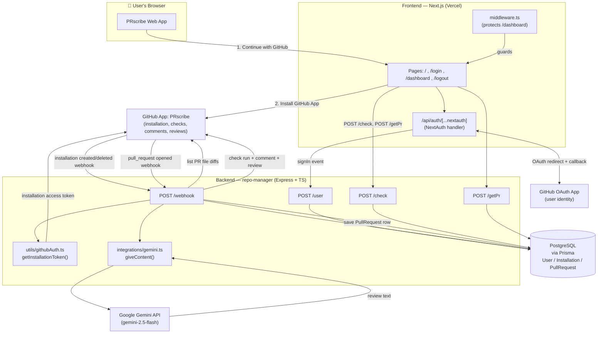
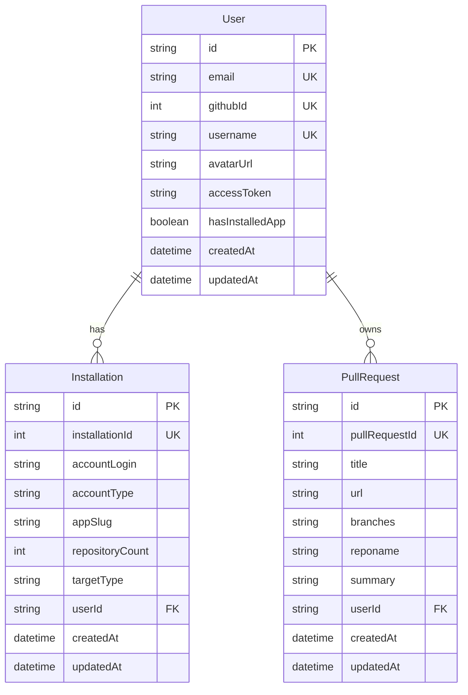
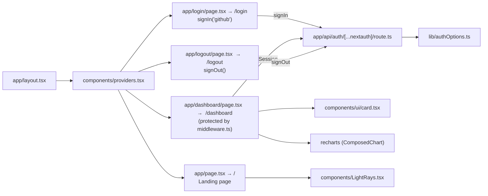
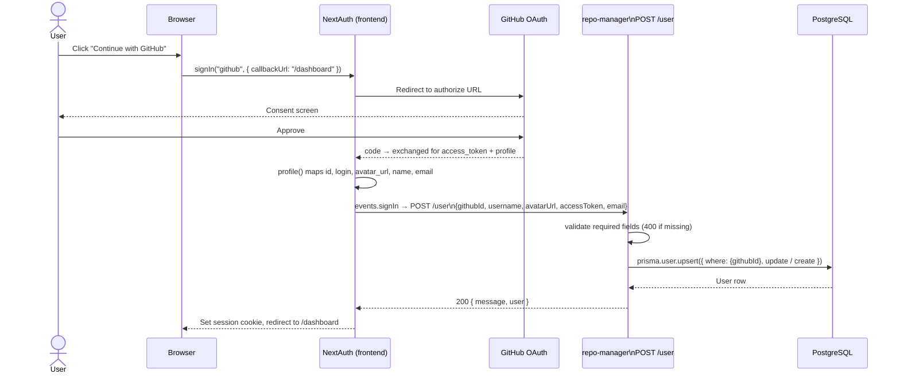
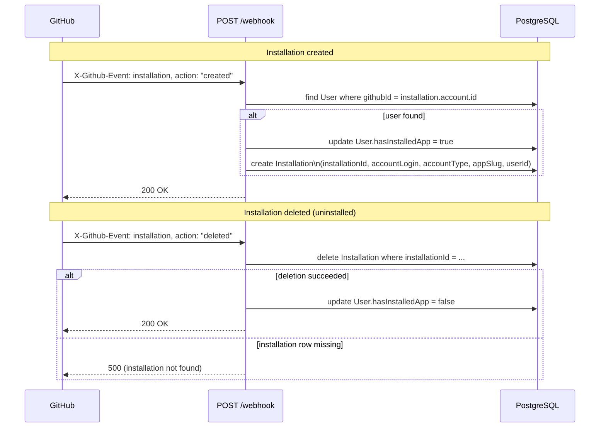
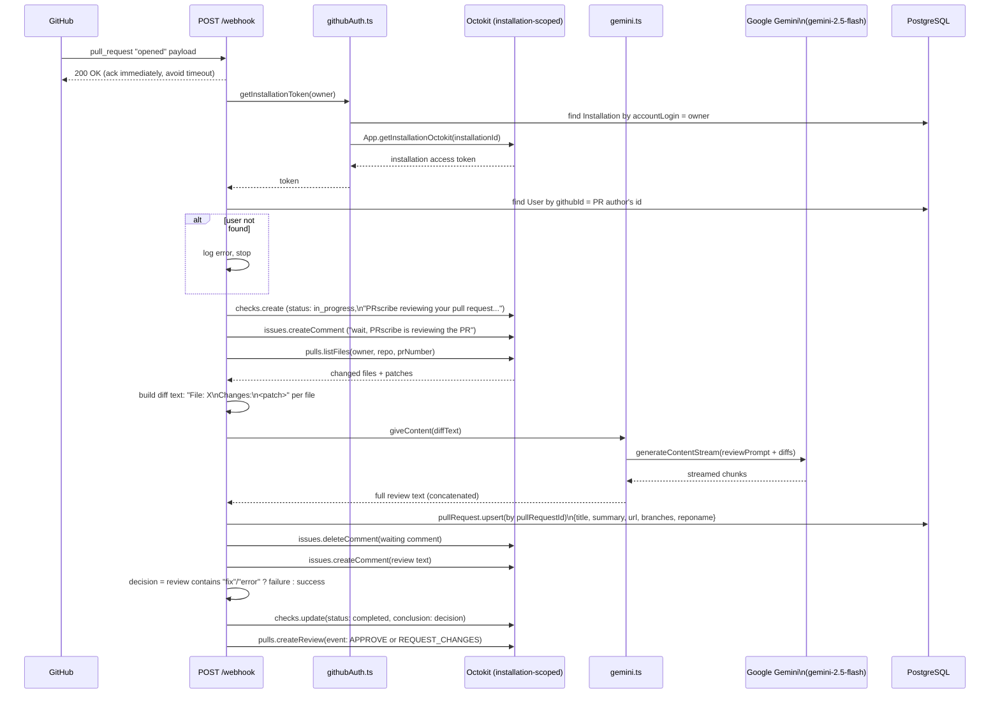
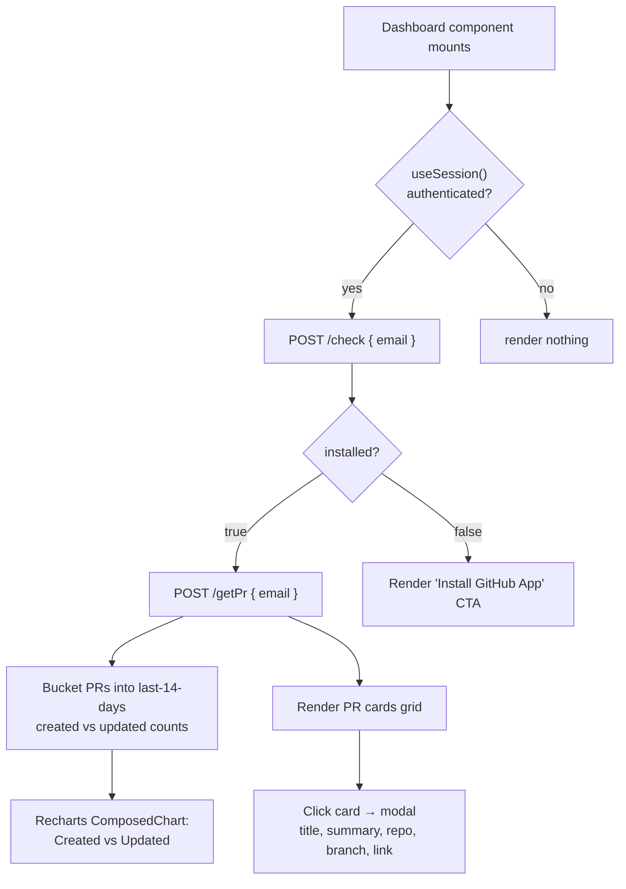
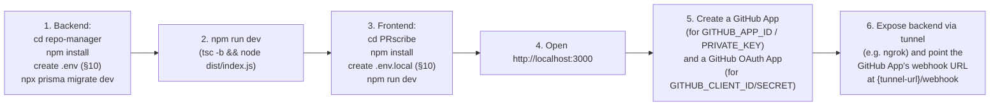

# PRscribe — AI Code Review for GitHub Pull Requests

PRscribe is a GitHub App that automatically reviews pull requests with AI. A user signs into a Next.js dashboard with GitHub, installs the **PRscribe GitHub App** on their repos, and from then on every opened PR gets: an in-progress check run, an AI-generated code review comment (via Gemini), a pass/fail check-run conclusion, sending email notification to repo maintainer and an automatic approve/request-changes review — all visible afterward on the dashboard.

| Repo | Role | Stack |
|---|---|---|
| `PRscribe` (frontend) | Marketing site, GitHub login, dashboard, session handling | Next.js 15 (App Router), React, TypeScript, NextAuth, Tailwind, Recharts |
| `repo-manager` (backend) | GitHub OAuth user-sync, GitHub App installation tracking, webhook-driven AI PR review, data API | Node.js, Express 5, TypeScript, Prisma + PostgreSQL, Octokit (GitHub App auth), Google Generative AI SDK |


---

## Table of Contents

1. [High-Level Architecture](#1-high-level-architecture)
2. [Repository Structure](#2-repository-structure)
3. [Database Schema (Prisma / PostgreSQL)](#3-database-schema-prisma--postgresql)
4. [Frontend — Route & Component Map](#4-frontend--route--component-map)
5. [Sign-in & User Sync Flow](#5-sign-in--user-sync-flow)
6. [GitHub App Installation Flow](#6-github-app-installation-flow)
7. [Pull Request AI Review Pipeline](#7-pull-request-ai-review-pipeline)
8. [Dashboard Data Flow](#8-dashboard-data-flow)
9. [Backend Route Reference](#9-backend-route-reference)
10. [Environment Variables](#10-environment-variables)
11. [Running Locally](#11-running-locally)
12. [Tech Stack Summary](#12-tech-stack-summary)
---

## 1. High-Level Architecture



Two distinct GitHub integrations are in play, and they're linked by `githubId`:

- **GitHub OAuth App** — used only for *user login* on the frontend (NextAuth, `lib/authOptions.ts`). Produces a session + syncs a `User` row.
- **GitHub App ("PRscribe")** — installed by the user on specific repos/orgs. It's what actually gets webhook deliveries (`installation`, `pull_request`) and what the backend authenticates as (via `@octokit/app` + a private key) to comment, create check runs, and submit reviews on PRs.

---

## 2. Repository Structure

### Frontend — `PRscribe/`

```
PRscribe/
├── app/
│   ├── api/auth/[...nextauth]/route.ts   # NextAuth API handler (GET/POST)
│   ├── dashboard/page.tsx                # Protected dashboard (PR list + chart)
│   ├── login/page.tsx                    # GitHub sign-in button
│   ├── logout/page.tsx                   # Sign-out confirmation
│   ├── layout.tsx                        # Root layout, fonts, <Providers>
│   └── page.tsx                          # Marketing / landing page
├── components/
│   ├── providers.tsx                     # <SessionProvider> wrapper
│   ├── LightRays.tsx / .css              # Decorative hero background
│   └── ui/                               # shadcn/ui primitives
├── lib/
│   ├── authOptions.ts                    # NextAuth config: GitHub provider + signIn event
│   └── utils.ts                          # `cn()` class-merge helper
├── middleware.ts                         # Route guard for /dashboard/*
└── package.json
```

### Backend — `repo-manager/`

```
repo-manager/
├── prisma/
│   ├── schema.prisma          # User, Installation, PullRequest models
│   └── migrations/            # 8 migrations tracking schema evolution
├── src/
│   ├── index.ts                # Express app: /user, /check, /dashboard, /getPr, /webhook
│   ├── integrations/
│   │   └── gemini.ts           # giveContent() — Gemini code-review prompt (streamed)
│   ├── utils/
│   │   └── githubAuth.ts       # getInstallationToken() — GitHub App auth via Octokit
│   └── types/
│       └── Github.d.ts         # GitHubUser type (currently unused in index.ts)
├── prisma.config.ts
├── tsconfig.json
└── package.json
```

The backend is TypeScript, compiled with `tsc -b` and run from `dist/index.js` (see `"dev": "tsc -b && node dist/index.js"` in `package.json`).

---

## 3. Database Schema (Prisma / PostgreSQL)



- `User.githubId` is the join key between the OAuth login identity and everything else (installations, PRs).
- `User.hasInstalledApp` is a denormalized flag flipped by the `installation` webhook, so `/check` can answer with a single row lookup instead of joining `Installation`.
- `PullRequest.summary` stores the Gemini-generated review text, which is what the dashboard's PR-detail modal displays.
- Migration history (`prisma/migrations/`) shows the schema evolving from a bare `username`/`password` table → dropping `password` → adding `PullRequest` → making `username`/`email` unique → adding `url`/extra fields — i.e. auth was originally going to be credential-based before GitHub OAuth was adopted.

---

## 4. Frontend — Route & Component Map



`middleware.ts` uses `withAuth` from `next-auth/middleware`, scoped via `matcher` to `/dashboard` and `/dashboard/:path*` — unauthenticated requests are redirected to `/login`.

---

## 5. Sign-in & User Sync Flow



- `POST /user` requires `githubId`, `username`, `avatarUrl`, `accessToken`, `email` — missing any returns `400`.

---

## 6. GitHub App Installation Flow

Once logged in, the dashboard prompts the user to install the **PRscribe GitHub App** (`github.com/apps/pr-managers`) if `hasInstalledApp` is `false`. GitHub then sends `installation` webhook events.



---

## 7. Pull Request AI Review Pipeline

The core feature. Triggered on `pull_request` events where `action === "opened"`.


---

## 8. Dashboard Data Flow



- `POST /check` looks up `User` by `email` and returns `{ installed: user.hasInstalledApp }`. If no user row exists, it returns `404`.
- `POST /getPr` looks up the `User` by `email`, then `prisma.pullRequest.findMany({ where: { userId } })`, returning `{ prdata: PullRequest[] }` — exactly the shape `app/dashboard/page.tsx` expects.
- The 14-day activity chart and the summary shown in the click-through modal (`selectedPr.summary`) are both fed directly from the `PullRequest.summary` column written by the webhook pipeline in [§7](#7-pull-request-ai-review-pipeline).

---

## 9. Backend Route Reference

| Method | Path | Purpose | Backed by |
|---|---|---|---|
| `GET` | `/` | Health/landing text ("Home Page. Welcome") | — |
| `POST` | `/user` | Upsert a user by `githubId` | Prisma `User` |
| `POST` | `/check` | Return `{ installed: boolean }` for a given email | Prisma `User.hasInstalledApp` |
| `GET` | `/dashboard` | Plain-text placeholder ("Dashboard page") | — (not the real dashboard; that's the Next.js `/dashboard`) |
| `POST` | `/getPr` | Return `{ prdata: PullRequest[] }` for a given email | Prisma `PullRequest` |
| `POST` | `/webhook` | Handles `installation` (created/deleted) and `pull_request` (opened) GitHub webhook events | Prisma `User`/`Installation`/`PullRequest` + Octokit + Gemini |


---

## 10. Environment Variables

### Frontend (`PRscribe/.env.local`)

| Variable | Used in | Purpose |
|---|---|---|
| `GITHUB_CLIENT_ID` | `lib/authOptions.ts` | GitHub **OAuth App** client ID (login) |
| `GITHUB_CLIENT_SECRET` | `lib/authOptions.ts` | GitHub OAuth App client secret |
| `NEXT_PUBLIC_BACKEND_URL` | `authOptions.ts`, `dashboard/page.tsx` | Base URL of the backend (must end in `/`) |
| `NEXTAUTH_SECRET` / `NEXTAUTH_URL` | NextAuth (implicit) | Session signing/config |

### Backend (`repo-manager/.env`)

| Variable | Used in | Purpose |
|---|---|---|
| `DATABASE_URL` | `prisma.config.ts`, all Prisma calls | PostgreSQL connection string |
| `GEMINI_API_KEY` | `integrations/gemini.ts` | Google Generative AI API key |
| `GITHUB_APP_ID` | `utils/githubAuth.ts` | GitHub **App** ID (installation auth, not OAuth) |
| `GITHUB_PRIVATE_KEY` | `utils/githubAuth.ts` | GitHub App private key (PEM, `\n`-escaped in env) |


---

## 11. Running Locally



---

## 12. Tech Stack Summary

**Frontend**
- Next.js 15 (App Router) + React + TypeScript
- NextAuth v4 (GitHub OAuth provider)
- Tailwind CSS v4 + shadcn/ui (`new-york` style) + `lucide-react`
- Recharts for the PR activity chart
- `axios` for calling the backend

**Backend**
- Node.js + Express 5, TypeScript (ESM, `"type": "module"`)
- Prisma ORM + PostgreSQL (8 migrations tracking schema evolution)
- `@octokit/app` + `octokit` — GitHub App authentication, checks, comments, reviews
- `@google/generative-ai`, model `gemini-2.5-flash`, streamed generation
- `cors`, `express-session`, `cookie-parser`, `jsonwebtoken` are installed but session/cookie/JWT machinery isn't exercised in `index.ts` — likely scaffolding for future auth-hardening

---